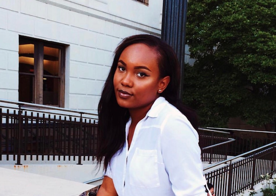
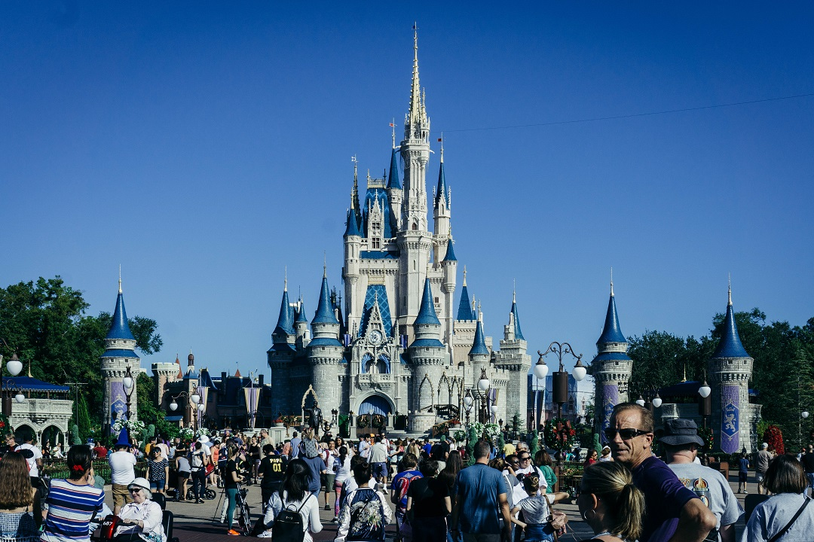

<!DOCTYPE html>
<head>
<title> Digital Skills 305 Homework #2 </title>
<meta charset="utf-8"/>
<link rel="stylesheet" href="sitewide.css" type="text/css">
<link href="https://fonts.googleapis.com/css?family=Acme|Cookie|Fondamento|IM+Fell+English|Lobster+Two|Risque|Vast+Shadow|Garamond" rel="stylesheet">
</head>

<body>
<h1>Cause of Death:  Disneyland</h1>
<h2>Built & Designed by Leanna Faulk</h2>

	<nav class="global-nav">
			<ul>
				<li><a href="index.html">Motive</a></li>
				<li><a href="crimescene.html">Crime Scene</a></li>
				<li><a href="evidence.html">Evidence</a></li>
			</ul>
		</nav>

<h2>MOTIVE  <em>About this Site</em></h2>
<h3>
	About the Author
</h3>

	<a href="https://www.facebook.com/leanna.faulk" target="_blank">Leanna Faulk</a> is a second-semester Sophomore at <a href="http://www.american.edu/" target="_blank">American University</a> in Washington D.C. She is pursuing a Bachelor's Degree in Communication Studies alongside two minors in Graphic Design and Business & Entertainment. Originally from New York, Leanna enjoys makeup, pizza (NY style only), drinks with friends, speaking in third person and of course, DisneyLand.

<h3>Why this Topic?</h3>

	As early as she can remember, Leanna spent most of childhood playing with Princess dolls and watching Disney movies. When she was eight years old or so, her parents surprised her little sister and herself with tickets to <a href="https://disneyworld.disney.go.com/" target="_blank">DisneyWorld</a> (not to be confused with DisneyLand). She had an amazing time but she never truly felt like she got the accurate experience of being in the amazing kingdom that we call DisneyLand. From there on, Leanna continuously pressured her parents into taking her to L.A. based Disney theme park but to her disdain, her parents never took her on that trip. To this day, she has never been able to experience what is known as "The Happiest Place On Earth". 

	The creation of this site is Leanna's way of keeping her love for DisneyLand hidden and finding anything possible to distract her from the beauty and amazement of America's Favorite Theme Park. Her theory is if she continuously thinks of these horrific events that have occurred at her favorite place - she'll eventually stop crying herself to sleep on the fact that she hasn't had her chance to visit. 

</body>
